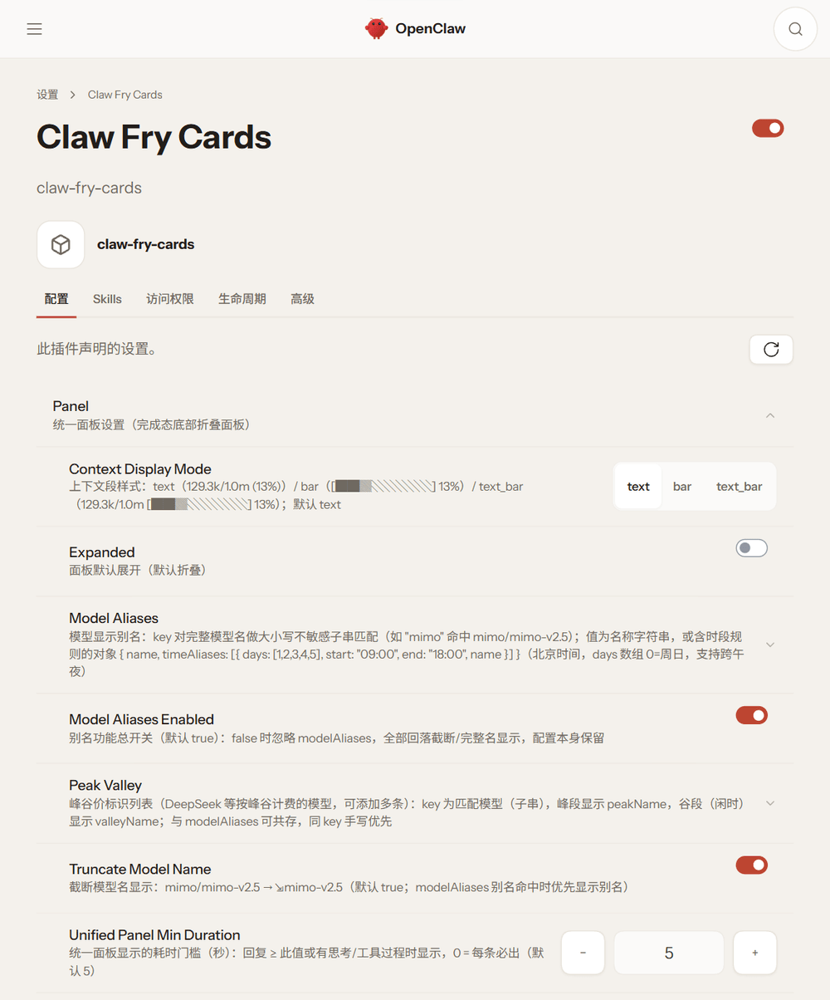

# 🍤 claw-fry-cards — 虾条卡片

[](LICENSE)
[](https://github.com/techysy/claw-fry-cards/releases)
[](https://www.npmjs.com/package/claw-fry-cards)
[](https://openclaw.ai)
[](https://nodejs.org/)

> OpenClaw 飞书/Lark 通道插件 — 在官方 [@larksuite/openclaw-lark](https://github.com/larksuite/openclaw-lark) 基础上适配 OpenClaw 2.0 SDK，并带来 fry 风格的虾条式流式卡片体验。


**这是什么**：一个**飞书通道插件**（替代官方 `@larksuite/openclaw-lark` / 内置 `@openclaw/feishu`），负责 OpenClaw Agent 的飞书消息收发，并用 CardKit v2.0 流式卡片呈现每一轮回复。

**为什么存在**：官方通道插件停更于 2026-07-16，未适配 OpenClaw 2.0（SDK 导出重构、会话存储迁移 SQLite），在新版网关上无法加载。本项目完成了 2.0 适配，并顺手把流式卡片体验升级到 fry-cards（[🍟 hermes-fry-cards](https://github.com/techysy/hermes-fry-cards)）同款风格。

## 🧭 版本说明（1.0 → 2.0）

| 版本 | 形态 | 获取方式 |
|------|------|----------|
| **2.0**（本主线） | **通道插件**：官方通道 2.0 适配，卡片引擎内置，替换官方通道 | main 分支 / `v2.0.0` 标签 |
| **1.0**（伴侣插件） | 钩子观测自建卡片，官方通道继续收发，不替换通道 | `git checkout v1.0.0`（降级使用） |

> 1.0 与 2.0 架构不同，**不要同时启用**（两套卡片会打架）。
> 2.0 前身 [claw-lark-cards](https://github.com/techysy/claw-lark-cards) 已合并入本仓库并废弃，后续仅在本仓库维护。

### 从 claw-lark-cards 升级

```bash
openclaw plugins uninstall openclaw-lark --force   # 或按其实际目录名卸载
# 再从本仓库构建安装（见下文 安装）
```

配置迁移：插件 id 已从 `openclaw-lark` 更名为 `claw-fry-cards`，`channels.feishu` 配置不变，仅需把
`plugins.entries.openclaw-lark` 改为 `plugins.entries.claw-fry-cards`。

### 从 1.0 伴侣插件升级

2.0 是通道插件，会**替换官方通道**。先卸载官方飞书通道（`openclaw plugins uninstall feishu --force`，注意该命令会删除 `channels.feishu` 配置，请备份后恢复），再安装本插件；1.0 的 `hooks.allowConversationAccess` 配置在 2.0 下不再需要。

---

## ✨ 特性

### 通道能力（承自官方，2.0 全量适配）

| 类别 | 能力 |
|------|------|
| 💬 消息 | 群聊/单聊收发、话题回复、消息搜索、图片/文件下载 |
| 📄 文档 | 云文档创建/更新/读取 |
| 📊 多维表格 | 数据表/字段/记录 CRUD、批量操作、高级筛选、视图 |
| 📈 电子表格 | 创建、编辑、查看 |
| 📅 日历 | 日程 CRUD、参会人、忙闲查询 |
| ✅ 任务 | 任务/清单/子任务/评论管理 |

### 🍤 虾条式流式卡片（本项目增强）

| 能力 | 说明 |
|------|------|
| ⚡ **派发即建卡** | 消息到达 1 秒内出现"处理中"卡片，生成期间不再是空白等待 |
| ✍️ **打字机输出** | 答案逐字上屏（基于 CardKit streaming_mode 客户端动画） |
| 🎯 **统一面板** | 完成态底部单一折叠面板，标题一行带全指标：`🍤 ⇲模型 · 💭N · 🔧N · 上下文 (x%) · 🎫 输出 · ⏱️耗时` |
| 🎨 **状态边框** | 面板边框颜色随结果变化：绿=完成 · 红=出错 · 黄=停止；展开可见思考过程与工具步骤明细 |
| ⏱️ **峰谷价标识** | DeepSeek 等按峰谷计费的模型按时间窗自动切换显示名（内置峰段预置，配置页可视化编辑，可多条） |
| 🏷️ **模型别名** | 大小写不敏感子串匹配 + 时段人设（星期数组化），模型名默认 ⇲ 截断 |
| 📊 **会话指标** | 模型名、token 用量、上下文窗口进度（实时读取 agent transcript SQLite） |

### OpenClaw 2.0 适配（Mirr0ch1 的适配工作 + 本项目整合）

- SDK 导入路径迁移（`openclaw/plugin-sdk` → `plugin-sdk/core` 等 100+ 处）
- 类型迁移（`ClawdbotConfig` → `OpenClawConfig`）、运行时配置 API 对齐
- 会话指标从 legacy sessions.json 迁移到 agent transcript SQLite
- 保留官方 TypeScript 源码与构建管线，产出标准 ESM（`dist/index.mjs`）

---

## 📦 安装

**要求**：OpenClaw ≥ 2026.5.12（实测加载下限，见 [docs/compat-test-report.md](docs/compat-test-report.md)；推荐 **2026.9.4+**——本地 Docker + 飞书真机全链路验证版本）· Node.js ≥ 22

### 方式一：一键安装脚本（推荐 · agent 友好）

```bash
curl -fsSL https://raw.githubusercontent.com/techysy/claw-fry-cards/main/install.sh | bash
```

脚本自动定位 OpenClaw CLI（`OPENCLAW_BIN` 可指定，找不到时走 `npx` 回退）、从 npm 安装最新版并验证插件注册。`FRY_VERSION=2.0.4` 可固定版本。**不会自动重启网关**（脚本可能运行在网关回合内，重启会杀掉自己）——装完自行执行 `openclaw gateway restart`。

### 方式二：npm 安装

```bash
openclaw plugins install claw-fry-cards --force --accept-capabilities
openclaw gateway restart
```

升级 / 重装用同一命令（`--force` 覆盖）。

### 方式三：从源码构建安装

```bash
git clone https://github.com/techysy/claw-fry-cards.git
cd claw-fry-cards
npm install --legacy-peer-deps
npm run build        # 产物在 dist/

openclaw plugins install . --force --accept-capabilities
openclaw gateway restart
```

> ⚠️ 若之前用过官方通道，先卸载并清理残留：`openclaw plugins uninstall feishu --force`（注意该命令会删除 `channels.feishu` 配置，请备份后恢复），并移除 `plugins.entries.feishu` 条目，否则网关收敛机制会把旧通道装回来。

## ⚙️ 配置



`~/.openclaw/openclaw.json`：

```json
{
  "channels": {
    "feishu": {
      "enabled": true,
      "domain": "feishu",
      "connectionMode": "websocket",
      "appId": "cli_xxxxxxxx",
      "appSecret": "xxxxxxxx",
      "dmPolicy": "open",
      "allowFrom": ["*"],
      "groupPolicy": "open",
      "groupAllowFrom": ["*"],
      "requireMention": true,
      "streaming": { "mode": "partial" }
    }
  },
  "plugins": {
    "entries": {
      "claw-fry-cards": {
        "enabled": true,
        "config": {
          "panel": {
            "unifiedPanelMinDuration": 5,
            "contextDisplayMode": "text",
            "peakValley": { "deepseek": { "peakName": "梁文锋⚡️", "valleyName": "梁文谷⚡️", "schedule": "deepseek" } },
            "modelAliases": { "mimo/mimo-v2.5": "小虾米" }
          }
        }
      }
    }
  }
}
```

**流式卡片三层开关**（缺一不可，排障按此顺序检查）：

| 层 | 配置（2026.9.4+） | 配置（旧宿主 ≤2026.9.1） | 说明 |
|----|------|------|------|
| ① 总开关 | `streaming: { mode: "partial" }` | `streaming: true` | 没有流式开关恒为纯文本（`mode: "off"` 关闭） |
| ② 模式 | 不需要（新宿主私聊即流式） | `replyMode: "streaming"` 或 `{default, group, direct}` | 旧宿主场景选择；auto 时私聊流式/群聊静态 |
| ③ 工具展示 | 默认开启 | 默认开启 | `toolUseDisplay` 不配置即启用（原版默认关闭，本项目已改） |

> 插件端对两代宿主 schema 均兼容（2.0.2 起自动识别 `streaming` 布尔/对象形态），按你的宿主版本选对应写法即可。

飞书应用需开通：`im:message`（收发消息）+ `cardkit:card`（卡片读写）。连接模式推荐 `websocket`（无需公网回调地址）。

### 🎯 统一面板（完成态底部折叠面板）

完成卡自动渲染，无需配置。行为如下：

| 项 | 行为 |
|----|------|
| 标题 | `🍤 ⇲模型 · 💭N · 🔧N · 368.6k/1.0m (37%) · 🎫 1.5k · ⏱️ 13.3s`（与 zcode-feishu-bridge 同款顺序；数据缺失的段自动省略） |
| 展开内容 | 思考过程（灰字标注）+ 工具调用步骤（图标/状态/耗时）；两者皆无时显示"暂无思考与工具调用过程" |
| 显示条件 | 回复耗时 ≥ 5 秒，**或**存在思考/工具过程 |
| 边框颜色 | 绿 = 完成 · 红 = 出错 · 黄 = 停止 |
| 展开状态 | 默认折叠，点击展开 |

**面板设置**：在 **Control UI → 设置 → Claw Fry Cards → 配置页** 可视化编辑（全中文字段说明），存储于插件自有配置 `plugins.entries.claw-fry-cards.config.panel`——随插件版本化，不受宿主 schema 演化影响（旧位置 `channels.feishu.panel` 仍兼容读取）：

```json
"panel": {
  "unifiedPanelMinDuration": 5,
  "contextDisplayMode": "text",
  "truncateModelName": true,
  "modelAliasesEnabled": true
}
```

| 配置项 | 说明 | 默认 |
|--------|------|------|
| `unifiedPanelMinDuration` | 面板显示的耗时门槛（秒）；回复 ≥ 此值或有思考/工具时显示，`0` = 每条必出 | `5` |
| `contextDisplayMode` | 📊 上下文段样式（上下文 used = 最后一轮 inputTokens；🎫 = 会话累计输出）：`text`（`129.3k/1.0m (13%)`）/ `bar`（`[██▓░░░░░] 13%`）/ `text_bar`（`129.3k/1.0m [██▓░░░░░] 13%`） | `text` |
| `expanded` | 面板默认展开 | `false` |
| `truncateModelName` | 截断模型名显示：`mimo/mimo-v2.5` → `⇲mimo-v2.5`（别名命中时优先显示别名） | `true` |
| `modelAliases` | 模型显示别名（子串匹配 + 可选时段规则），见下节 | 空 |
| `modelAliasesEnabled` | 别名功能总开关；`false` 时忽略 `modelAliases` 整体回落截断，配置本身保留 | `true` |
| `peakValley` | 峰谷价标识（record，key=匹配模型），见下节 | 空 |

### ⏱️ 按时间切换显示名（峰谷价 / 时段人设）

面板模型名支持按时间窗自动切换显示——典型用途是 DeepSeek 的**峰谷价标识**（峰段梁文锋⚡️ / 谷段梁文谷⚡️，一眼看出当前计费档位），也适用于任何时段人设。

**配置入口：Control UI → 设置 → Claw Fry Cards → 配置页**，全部可视化编辑，无需手写 JSON：

| 想要 | 在配置页操作 |
|------|--------------|
| 峰谷价标识（推荐，两行搞定） | 展开 **Peak Valley** → 添加条目 → 键填匹配模型（如 `deepseek`）→ 值里填峰时显示 / 谷时显示 → 时间表下拉选择 |
| 模型别名（含时段规则） | 展开 **Model Aliases** → 添加条目 → 键填匹配模型子串（如 `mimo`）→ 值里填名称，需要时段切换就加时段规则（星期逐项勾选、起止时间） |
| 纯别名（不按时段） | 同上，值只填名称字符串 |

- **匹配**：键对完整模型名做大小写不敏感子串匹配，按插入顺序第一条命中即生效（`mimo` 命中 `mimo/mimo-v2.5`）
- **时间表**（峰谷价专用预置）：`deepseek`（工作日 9:00–12:00 & 14:00–18:00 峰段）/ `workday-918` / `everyday-day` / `always-peak` / `custom`
- 时段规则里 `days` 星期逐项选择（`0`=周日），`start`/`end` 为北京时间 HH:MM，支持跨午夜；规则都不命中时回落默认名称（即"其他时间"）
- 两种写法可共存：peakValley 运行时展开为等价时段规则，同键时 Model Aliases 手写条目优先；别名命中优先于 ⇲ 截断；**Model Aliases Enabled** 开关可整体关闭别名

<details>
<summary>对应的 openclaw.json 配置（直改配置文件时参考）</summary>

```json
"panel": {
  "peakValley": {
    "deepseek": { "peakName": "梁文锋⚡️", "valleyName": "梁文谷⚡️", "schedule": "deepseek" },
    "gemini":   { "peakName": "Gemini☀️",  "valleyName": "Gemini🌙",  "schedule": "workday-918" }
  },
  "modelAliases": {
    "deepseek": {
      "name": "梁文谷⚡️",
      "timeAliases": [
        { "days": [1, 2, 3, 4, 5], "start": "09:00", "end": "12:00", "name": "梁文锋⚡️" },
        { "days": [1, 2, 3, 4, 5], "start": "14:00", "end": "18:00", "name": "梁文锋⚡️" }
      ]
    },
    "mimo": "小虾米"
  }
}
```

</details>

> 指标来源是 agent transcript SQLite（`~/.openclaw/agents/<agent>/agent/openclaw-agent.sqlite`），模型名/token/上下文窗口由最近一轮 usage 事件解析。老版本宿主无此库时统一面板自动省略指标段（详见 [docs/compat-test-report.md](docs/compat-test-report.md)）。

---

## 🧪 开发

```bash
npm install --legacy-peer-deps
npm run build       # tsdown → dist/
npm test            # vitest
npm run typecheck   # tsc --noEmit
```

构建产物分 chunk（`index.mjs` + `monitor-<hash>.mjs`），部署时需全部拷贝到扩展目录并删除旧 hash 残留文件。

## 🙏 归属

基于 [larksuite/openclaw-lark](https://github.com/larksuite/openclaw-lark)（MIT）· 2.0 适配：[@Mirr0ch1](https://github.com/Mirr0ch1) · 卡片样式：[hermes-fry-cards](https://github.com/techysy/hermes-fry-cards) · 1.0 伴侣插件形态保留于 `v1.0.0` 标签

## 🔒 安全提示

承袭官方插件的安全模型：OpenClaw AI 自动化存在模型幻觉、不可预测执行与提示注入风险；授权飞书权限后 Agent 将在授权范围内以你的身份操作。建议将机器人作为**私聊助手**使用，勿随意加入群聊，勿放宽默认安全策略。使用即表示理解并自担相关风险。

## 📄 许可证

[MIT](LICENSE) —— 沿用官方 openclaw-lark 的许可。
