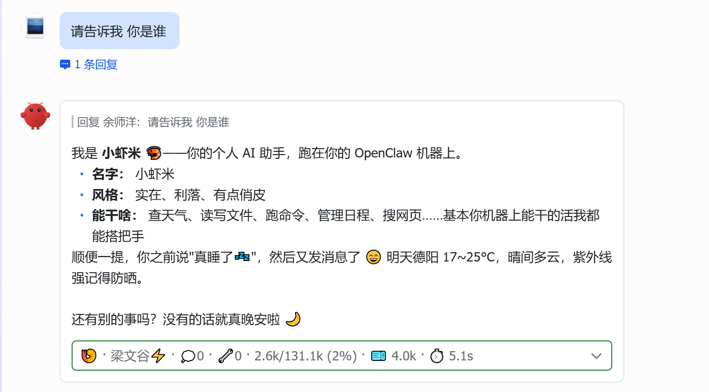

# 🍤 claw-fry-cards — 虾条卡片

[](LICENSE)
[](https://docs.openclaw.ai)
[](https://nodejs.org/)

> OpenClaw 飞书流式卡片**伴侣插件** — fry-cards 风格的 CardKit v2.0 卡片：统一指标面板 · 实时工具进度 · 打字机收尾。



**这是什么**：[🍟 hermes-fry-cards](https://github.com/techysy/hermes-fry-cards)（Hermes 薯条卡片）的 OpenClaw 移植版。它**不负责消息收发**——飞书通道仍由官方插件承担，本插件通过 OpenClaw 公开钩子观测每轮对话，用自建 CardKit 卡片**接管回复展示**。

## 🧭 两个项目怎么选

| | 🍤 claw-fry-cards（本仓库） | 🦐 [claw-lark-cards](https://github.com/techysy/claw-lark-cards) |
|---|---|---|
| 形态 | **伴侣插件**，官方通道继续收发 | **通道插件**（官方 fork + 2.0 适配），替换官方通道 |
| 卡片接管 | 钩子观测 + 自建卡片 | 通道内置流式引擎 |
| 打字机 | 完成后分片输出 | 关流式前灌全文，客户端逐字动画 |
| 思考展示 | 仅回复文本中的 `<thinking>` 标签 | 原生 reasoning（模型支持时） |
| 适合 | 想继续用官方通道、轻量增强 | 想要完整 fry 体验、不介意换通道 |

> 二选一，**不要同时启用**（两套卡片会打架）。OpenClaw 2026.9.x 上推荐 claw-lark-cards。

---

## ✨ 特性

| 能力 | 说明 |
|------|------|
| ⚡ **即时建卡** | `message_received` 触发，蓝色"处理中"卡（工具面板 + loading）立刻出现 |
| 🔧 **工具面板** | `before/after_tool_call` 驱动：图标映射、Running/Succeeded/Failed、耗时、脱敏参数预览 |
| 🎯 **统一面板** | 完成态底部折叠面板：`🍤 ⇲模型 · 💭N · 🔧N · 🎫↑↓ · 📊上下文进度条 · ⏱️耗时`，边框随状态（绿/红/黄） |
| ✍️ **打字机收尾** | `message_sending` / `reply_payload_sending` 双钩子接管，答案分片写入后取消官方文本投递（防重复） |
| 🛡️ **全链路回落** | 建卡/封卡失败、卡片超时（15 分钟）、交互组件消息 → 自动回落官方通道文本，消息永不丢失 |
| 🧠 **思考剥离** | `<thinking>` / `<antthinking>` / `Reasoning:` 标签自动解析进统一面板 |
| 🌐 **中英双语** | 卡片文案跟随飞书客户端语言 |
| 🔒 **安全脱敏** | 工具命令中的密钥（token/api_key/Authorization/--flag）与路径自动脱敏后才上卡 |

> ⚠️ 架构边界：OpenClaw 公开钩子不提供 token 级流式增量，模型的 API reasoning（如 mimo/GLM 的 `reasoning_content`）对伴侣插件不可见——需要原生思考流请用 claw-lark-cards。

---

## 📦 安装

**要求**：OpenClaw ≥ 2026.2.26 · Node.js ≥ 22 · 官方飞书通道可用（`@larksuite/openclaw-lark` 或内置 `@openclaw/feishu`）

```bash
git clone https://github.com/techysy/claw-fry-cards.git
cd claw-fry-cards
npm install
npm run build
openclaw plugins install . --force --accept-capabilities
openclaw gateway restart
```

## ⚙️ 配置

`~/.openclaw/openclaw.json`：

```json
{
  "plugins": {
    "entries": {
      "claw-fry-cards": {
        "enabled": true,
        "hooks": { "allowConversationAccess": true },
        "config": {
          "feishu": { "brand": "feishu", "app_id": "cli_xxx", "app_secret": "xxx" },
          "display": {
            "show_tool_use": true,
            "context_display_mode": "text_bar",
            "unified_panel_min_duration": 5
          }
        }
      }
    }
  }
}
```

- **`hooks.allowConversationAccess: true` 必须配置**——`llm_output` / `agent_end` 属于会话级钩子，缺它会被网关静默拦截（面板缺模型/上下文数据的常见原因）
- 凭据与官方飞书通道**共用同一个飞书应用**即可；`brand: "lark"` 走国际版
- `unified_panel_min_duration`：统一面板的耗时门槛（秒），回复 ≥ 此值必出面板；设 0 则每条都出

<details>
<summary>全部配置项</summary>

| 配置项 | 说明 | 默认 |
|--------|------|------|
| `feishu.brand` | `feishu` / `lark` | `feishu` |
| `chats.allowlist` / `blocklist` | 会话白/黑名单（chat_id） | 空=全部 |
| `streaming.header_enabled` | 顶部状态栏 | `false` |
| `streaming.footer_enabled` | 底部元数据栏 | `false` |
| `streaming.width_mode` | `default` / `compact` / `fill` | `default` |
| `streaming.flush_interval_ms` | 打字机分片间隔 | `100` |
| `streaming.typewriter_max_ms` | 打字机最长耗时 | `3000` |
| `streaming.stale_timeout_sec` | 无更新自动封卡超时 | `900` |
| `display.show_tool_use` | 工具面板 | `true` |
| `display.show_context` | 上下文显示 | `true` |
| `display.context_display_mode` | `text` / `bar` / `text_bar` | `text_bar` |
| `display.truncate_model_name` | `openai/gpt-5.4` → `⇲gpt-5.4` | `true` |
| `display.unified_panel_min_duration` | 统一面板耗时门槛（秒），回复 ≥ 此值必出面板 | `5` |
| `streaming.stale_timeout_sec` | 无更新自动封卡超时（秒） | `900` |
| `display.unified_panel_min_duration` | 面板耗时门槛（秒） | `5` |
| `display.cancel_text_on_card` | 接管后取消官方文本 | `true` |
| `display.loading_icon_img_key` | 自定义 loading 图标 | 内置 |

</details>

## 🎯 统一面板

完成卡底部自动渲染的折叠面板（无独立开关，受 `show_tool_use` 与耗时门槛控制）：

| 项 | 行为 |
|----|------|
| 标题 | `🍤 ⇲模型 · 💭N · 🔧N · 🎫↑in↓out · 📊used/total [████▓░] x% · ⏱️耗时`（`context_display_mode` 控制 📊 段样式，数据缺失段自动省略） |
| 展开内容 | 思考过程（来自回复文本中的 `<thinking>` 等标签）+ 工具调用步骤（图标/状态/耗时/脱敏参数） |
| 显示条件 | 回复耗时 ≥ `unified_panel_min_duration`（默认 5 秒），**或**存在思考/工具过程；`show_tool_use: false` 时整体关闭 |
| 边框颜色 | 绿 = 完成 · 红 = 出错 · 黄 = 停止 |

> 想每条回复都带面板：`unified_panel_min_duration: 0`。指标来自 `llm_output` 钩子（模型/token）与 `agent_end`（耗时）——**必须配置 `hooks.allowConversationAccess: true`**，否则这几段静默缺失。

## 🩺 故障排查

| 现象 | 原因 | 解决 |
|------|------|------|
| 一直纯文本，没有卡片 | 凭据缺失或插件未启用 | 日志搜 `config missing feishu` |
| 有卡片但面板缺模型/上下文 | `allowConversationAccess` 未配置 | 补上该配置并重启网关 |
| 日志 `typed hook "llm_output" blocked` | 同上 | 同上 |
| 安装报 `world-writable path` | Windows/Docker 挂载目录权限 777 | 拷到本地目录再安装 |
| 安装报 `requires capability consent` | 未接受能力声明 | 加 `--accept-capabilities` |
| 回复出现两条（卡片+文本） | 封卡失败回落 | 日志搜 `card_seal_failed` |

日志统一带 🍤 前缀：`docker logs <网关容器> | grep 🍤`。

## 🧪 开发

```bash
npm install
npm test          # vitest — 86 tests
npm run typecheck # tsc --noEmit (strict)
npm run build     # tsdown → dist/index.mjs
```

已在真实 OpenClaw 2026.9.1 + 飞书环境全链路验证（建卡 → 工具进度 → 接管 → 统一面板）。

## 🙏 归属

移植自 [hermes-fry-cards](https://github.com/techysy/hermes-fry-cards)（源自 [hermes-lark-streaming](https://github.com/Cheerwhy/hermes-lark-streaming)，MIT）· 姊妹项目 [claw-lark-cards](https://github.com/techysy/claw-lark-cards)

## 📄 许可证

[MIT](LICENSE)
